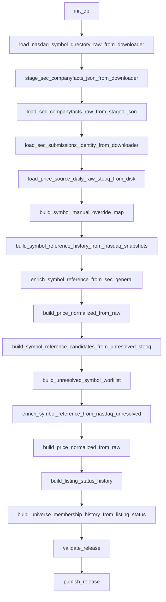

# 02 — Pipeline opératoire

## Pipeline recommandé

## Passage pratique

L’état actuel observé montre qu’on peut raisonnablement enchaîner :
- identité
- prix normalisés
- listing status
- univers
- validation release
- publication
