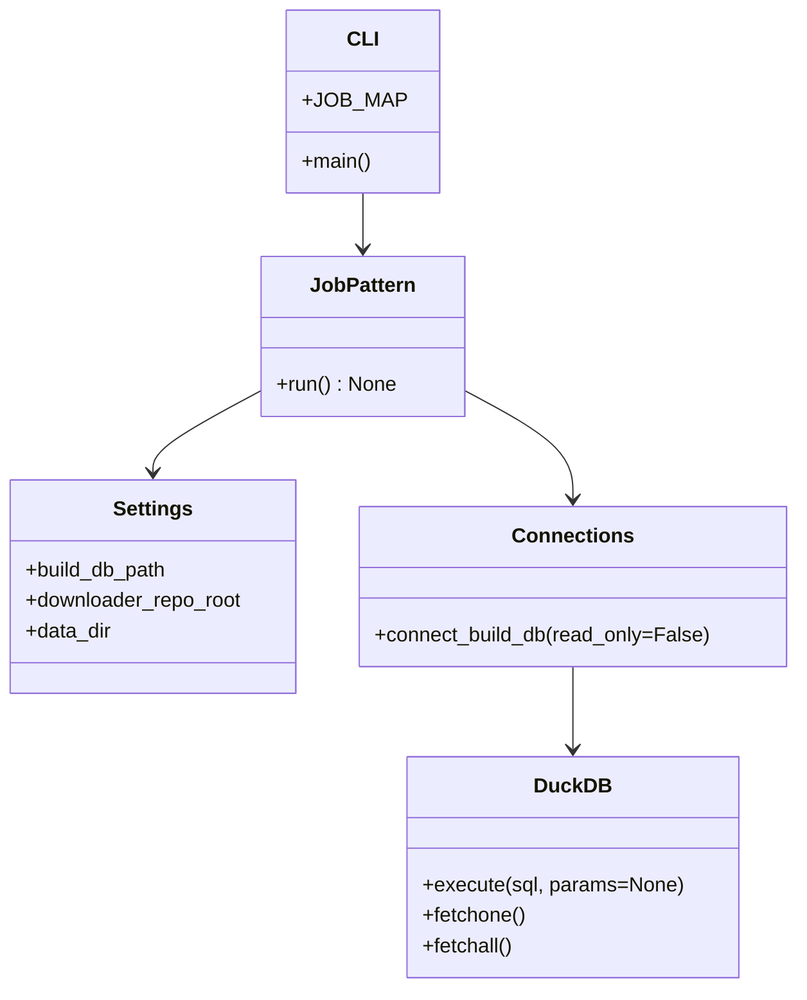

# 03 — Architecture et UML


```mermaid
classDiagram
    class CLI {
        +JOB_MAP
        +main()
    }

    class Settings {
        +build_db_path
        +downloader_repo_root
        +data_dir
    }

    class Connections {
        +connect_build_db(read_only=False)
    }

    class JobPattern {
        +run() None
    }

    class DuckDB {
        +execute(sql, params=None)
        +fetchone()
        +fetchall()
    }

    CLI --> JobPattern
    JobPattern --> Settings
    JobPattern --> Connections
    Connections --> DuckDB
```

## Pattern dominant

```python
def run() -> None:
    configure_logging()
    conn = connect_build_db()
    try:
        ...
    finally:
        conn.close()
```
